# Cloudsec Remote Browser RBI Architecture

This document explains how `cloudsec_remote_browser` implements remote browser isolation
for SWG-selected traffic, what network techniques it uses, and what gaps remain before
production use.

## Scope

`cloudsec_remote_browser` is an RBI runtime. It starts remote Chromium workers and
streams the remote browser session back to the user. It does not decide policy. SWG and
policy-engine remain responsible for URL category, tenant policy, action selection,
DLP, file handling, auth posture, and provider canary selection.

The supported integration shape is:

- SWG receives a browser navigation.
- Policy-engine and SWG decide final action `ISOLATE`.
- SWG signs a bootstrap request to `cloudsec_remote_browser`.
- `cloudsec_remote_browser` creates a remote browser session and launches a worker.
- SWG redirects the user browser to a signed handoff URL.
- The viewer and worker establish role-bound WebRTC/SRTP legs to the regional media
  gateway, which relays media and input without exposing worker addresses.

## Isolation Model

This implementation is a pixel-streamed remote Chromium RBI model.

It is not headless-only. Chromium runs remotely with a graphical display surface in the
worker environment. The worker captures that browser display, encodes it as a media
stream, and sends the pixels to the viewer over gateway-relayed WebRTC/SRTP.

It is not a full remote desktop product. The intended exposed surface is the isolated
browser session, not an arbitrary operating-system desktop where users can run other
applications.

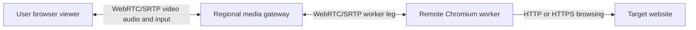

The user receives video and audio from the remote browser. Pointer, keyboard, wheel,
and browser-history inputs are sent back to the worker over gateway-bridged WebRTC
data channels.

Current stream defaults:

- Display defaults to `1280x720`.
- Initial worker stream scale defaults to `1.0`, so gateway-mode sessions start at
  full 720p before viewer viewport sync sends any resize/configure message.
- Standalone worker codec preference defaults to `VP8`; `VIDEO_CODEC_PREFERENCES`
  remains the rollback override for explicit codec order such as `H264,VP8`.

Model classification:

- Best label: pixel-streamed remote Chromium RBI.
- Not strict headless: the browser has a graphical surface that is captured.
- Not full remote desktop: only the isolated browser workflow is intended to be exposed.

## System Context

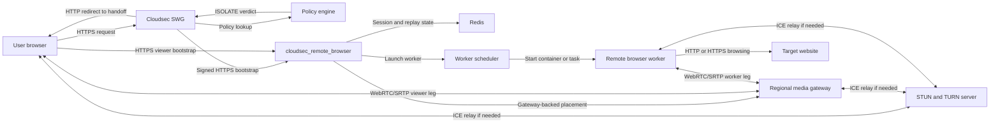

## Runtime Components

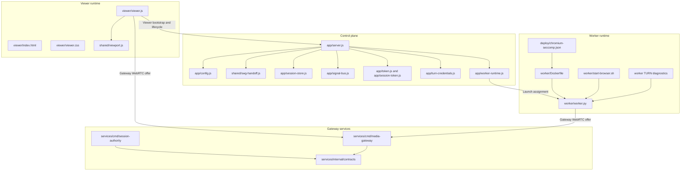

## Transport Model

The implementation uses separate control, signaling, and media planes.

| Plane | Protocol | Transport | Purpose |
| --- | --- | --- | --- |
| SWG bootstrap | HTTPS | TCP or TLS over TCP | SWG creates an RBI session after isolate decision |
| Handoff | HTTPS redirect | TCP or TLS over TCP | Browser receives a signed first-party viewer entry |
| Static viewer | HTTPS | TCP or TLS over TCP | Browser loads `/viewer`, JS, CSS, and shared JS |
| Gateway WebRTC offer | HTTPS | TCP or TLS over TCP | Viewer and worker post role-bound SDP offers to `/gateway/webrtc/:sessionId/:role/offer` |
| Control signaling | WebSocket or WSS | TCP or TLS over TCP | Registration, lifecycle, heartbeats, pending signals, and rollback direct-peer signaling |
| Media | WebRTC SRTP | Usually UDP | Viewer-to-gateway and worker-to-gateway media legs |
| Input | WebRTC data channel | SCTP over DTLS over ICE | Keyboard, pointer, wheel, and browser history commands bridged by the gateway |
| NAT traversal | STUN | Usually UDP 3478 | Discover server-reflexive ICE candidates |
| Relay fallback | TURN | UDP 3478, TCP 3478, or TLS TCP 443 | Relay a WebRTC leg when ICE cannot reach the gateway or rollback peer path directly |
| Shared state | Redis | TCP | Multi-instance sessions, pending signals, replay keys |

In production, the important design point is that WebSocket is not the media path.
Gateway mode exchanges SDP through role-bound HTTPS offer endpoints and carries the
real-time stream over WebRTC/SRTP through the media gateway. The legacy direct
viewer-to-worker WebRTC path remains a rollback mode, not the default production path.

## SWG Bootstrap Flow

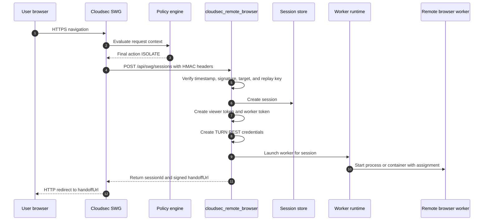

Bootstrap validation is implemented in `app/server.js` and `shared/swg-handoff.js`.
The signature is `hex(hmac_sha256(SWG_SHARED_SECRET, canonical_string))`. The canonical
string includes method, target URL, timestamp, transaction ID, tenant, profile, policy,
and upstream metadata.

## Handoff Flow

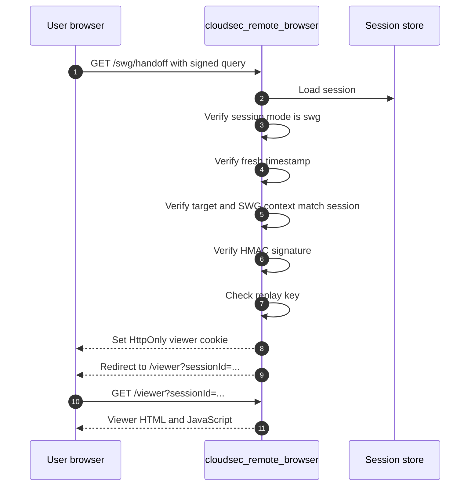

The handoff URL is signed but not confidential. It includes metadata that should be
treated as sensitive in logs and referrers. The viewer cookie is first-party, HttpOnly,
SameSite Lax, and marked Secure when the public origin is HTTPS.

## Control Signaling And Rollback Flow

Gateway WebRTC relay sessions use role-bound media-gateway offer endpoints for SDP
exchange. The app WebSocket path still carries registration, lifecycle, state, pending
messages, and rollback direct-peer signaling. The sequence below describes that
rollback/direct-peer broker behavior.

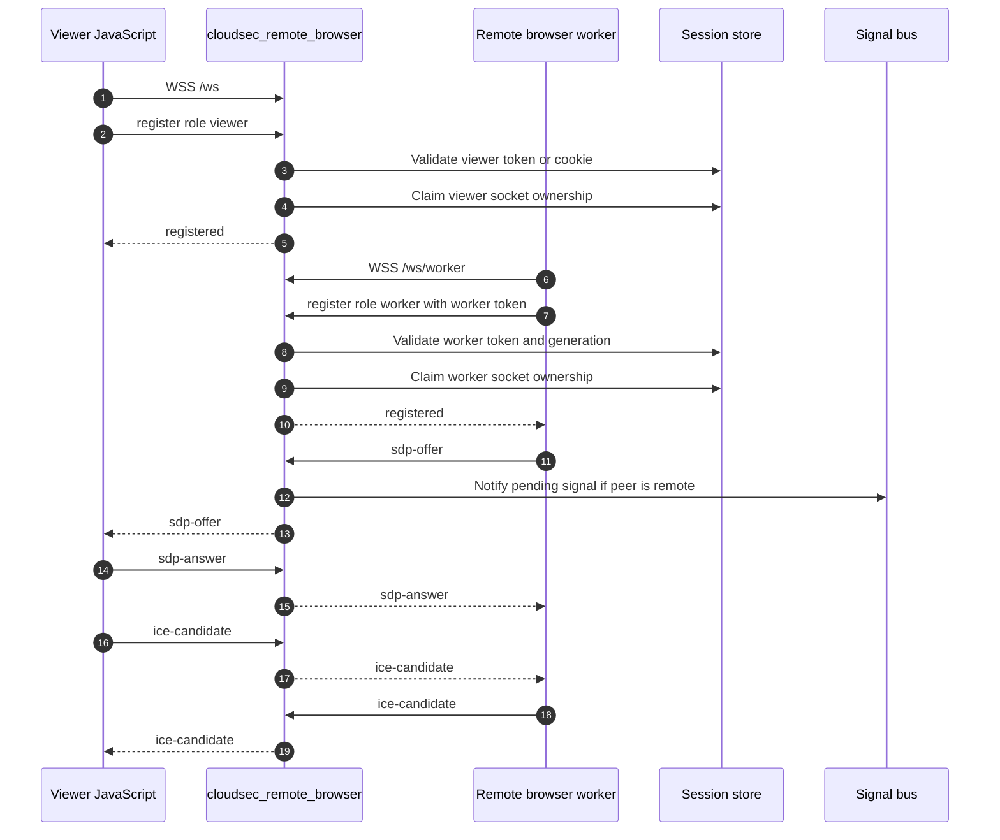

The WebSocket path is only a broker. It forwards JSON messages between the viewer and
worker and persists pending signals if one side reconnects or lands on a different
control-plane instance.

## Gateway WebRTC Media Flow

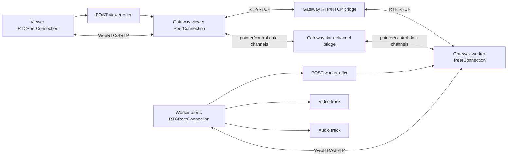

The viewer creates a browser `RTCPeerConnection` for the gateway viewer leg and posts
its offer to the media gateway. The worker creates an `aiortc.RTCPeerConnection` for
the gateway worker leg and posts its offer to the worker role endpoint derived from
`MEDIA_GATEWAY_URL`.

Gateway relay is enabled when the worker assignment contains:

```text
MEDIA_PLANE_MODE=gateway-webrtc-relay
MEDIA_RELAY_PROTOCOL=webrtc-srtp
MEDIA_GATEWAY_URL=<https gateway worker endpoint>
```

The worker uses strict VP8 preferences in gateway mode. Standalone workers also default
to `VIDEO_CODEC_PREFERENCES=VP8`; setting `VIDEO_CODEC_PREFERENCES=H264,VP8` or another
ordered list remains the explicit rollback override.

The worker sends:

- video from the remote Chromium display capture pipeline;
- audio from the worker audio capture pipeline when available;
- state and diagnostics over control signaling;
- SDP offers to the gateway role endpoint for initial connect and ICE restarts.

The viewer sends:

- SDP offers to the gateway viewer role endpoint;
- ICE candidates after candidate filtering;
- user input through gateway-bridged WebRTC data channels after peer connection setup.

Before the viewer sends any viewport sync (`viewport.resize` or `stream.configure`),
the worker initializes the video target at full display scale. With the default display
this means the first frames are `1280x720`, not a downscaled 360p stream.

## ICE And TURN Behavior

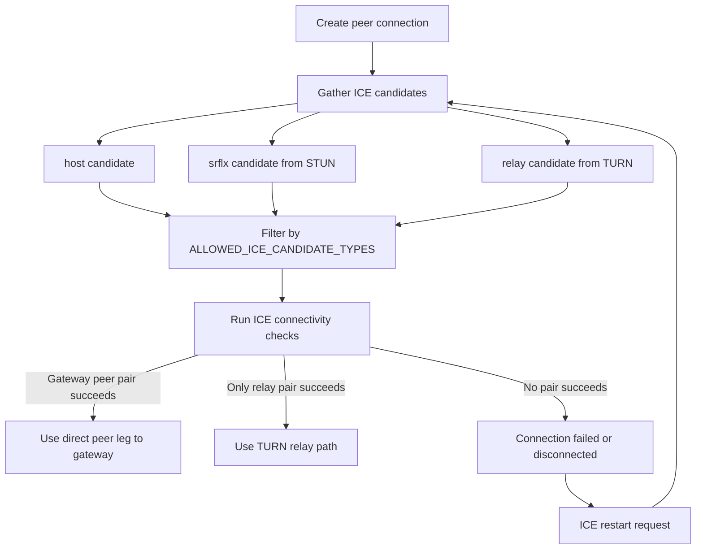

In gateway mode, ICE forms viewer-to-gateway and worker-to-gateway legs. It does not
form a direct viewer-to-worker media path. The direct viewer-to-worker WebRTC behavior
is retained only for rollback configurations.

Default candidate policy:

- Local default: `host`, `srflx`, and `relay`.
- Non-local default: `srflx` and `relay`.
- Production-safe option: force `relay` with `ALLOWED_ICE_CANDIDATE_TYPES=relay` and `VIEWER_ICE_TRANSPORT_POLICY=relay`.

Default ICE URL shape:

```text
stun:<turn-host>:3478
turn:<turn-host>:3478?transport=udp
turn:<turn-host>:3478?transport=tcp
turns:<turn-host>:443?transport=tcp
```

`turns` is important for restricted networks because outbound TLS on port 443 is often
allowed even when UDP 3478 is blocked.

## Worker Lifecycle

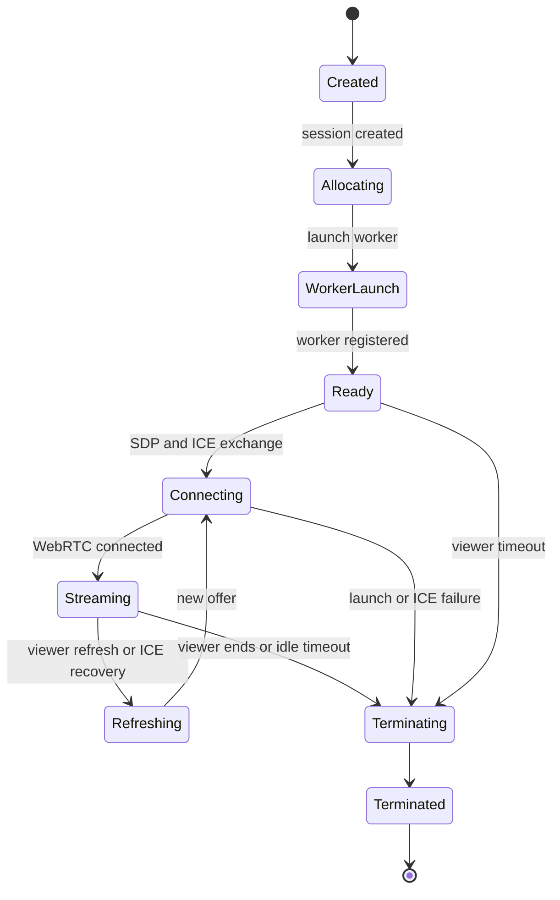

The worker can be launched through the current `app/worker-runtime.js` adapter:

- `docker`: starts a local Docker container.
- `ecs`: starts an ECS task.
- `host-agent`: calls a worker host agent and can support regional placement.

Cloudsec should narrow this to the production scheduler instead of keeping all modes
enabled by default.

## Security Controls

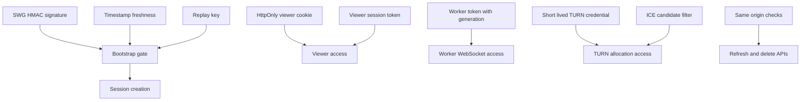

Security controls currently implemented:

- HMAC-authenticated SWG bootstrap.
- Freshness window for bootstrap and handoff timestamps.
- Replay protection with Redis when deployed multi-instance.
- First-party viewer cookie for SWG-launched viewer access.
- Separate viewer and worker tokens.
- Worker token generation checks to reject stale workers.
- Short-lived TURN REST credentials.
- Candidate filtering to reduce unwanted direct network paths.
- Same-origin checks for viewer mutation APIs.

## Session Lifecycle And Disposal

Each isolated navigation creates a separate RBI session. The session is the control-plane
object that binds target URL, SWG context, viewer access, worker access, TURN credentials,
socket ownership, and lifecycle timers.

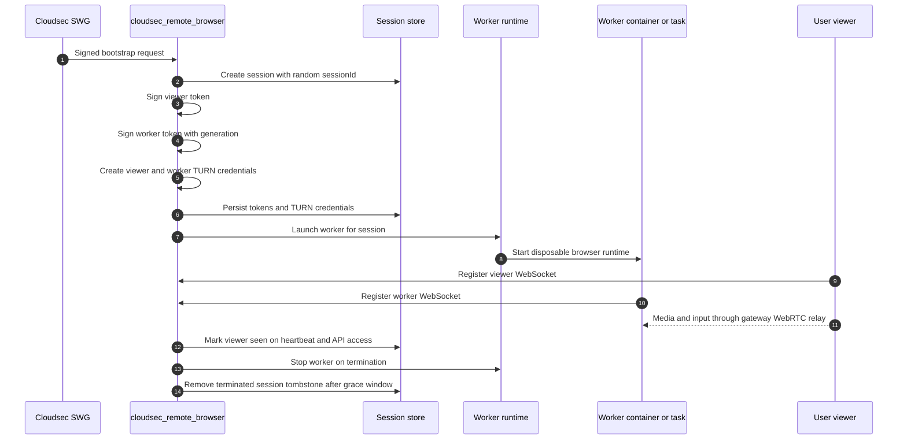

Implemented session controls:

| Control | Implementation |
| --- | --- |
| Session identifier | Generated with `crypto.randomUUID()` and `sess_` prefix |
| Session state | Tracks `allocating`, `ready`, `streaming`, `idle`, and `terminated` states |
| Viewer authorization | Signed viewer token plus HttpOnly first-party cookie for SWG handoff |
| Worker authorization | Signed worker token with session generation |
| Stale worker defense | Worker messages are ignored when generation no longer matches |
| TURN authorization | Separate short-lived viewer and worker TURN REST credentials |
| Socket ownership | One current viewer socket and one current worker socket per session |
| Pending signaling | Stored per role and drained after reconnect or cross-instance delivery |
| Expiry | Session keys expire by `expiresAt`; Redis uses `PEXPIREAT` |
| Idle cleanup | Viewer disconnect starts idle timer; default is 5 minutes |
| No-viewer cleanup | Session terminates if viewer never connects; default is 90 seconds |
| Worker cleanup | Worker disconnect terminates the session after a short grace window |
| Tombstone cleanup | Terminated session records are removed after a grace period |

Default lifecycle timers:

```text
SESSION_TTL_MS=10800000
IDLE_TIMEOUT_MS=300000
VIEWER_CONNECT_TIMEOUT_MS=90000
TURN_CREDENTIAL_TTL_SECONDS=300
SWG_REPLAY_TTL_MS=600000
```

The intended disposal model is:

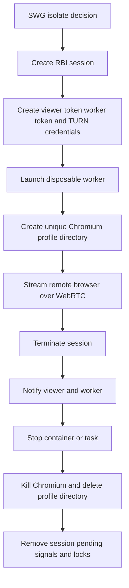

Worker-side disposal controls currently present:

- The worker image runs as non-root user `rbi`.
- Chromium is launched with a unique `--user-data-dir` derived from a UUID.
- Chromium remote debugging is bound to `127.0.0.1` inside the worker.
- Chromium sync is disabled.
- Chromium sandbox is enabled by default unless `WORKER_DISABLE_CHROMIUM_SANDBOX=1`.
- Worker shutdown closes the CDP WebSocket, terminates Chromium, force-kills if needed,
  and removes the per-session profile directory.
- Docker launch can use `--rm` and the extracted Chromium seccomp profile.
- ECS launch stops the task when the session terminates.

Security posture statement: the service should assume every visited website is hostile
and that the remote browser can be compromised. The control plane provides session and
access controls, but data-leak and malware containment require the worker runtime to be
treated as untrusted infrastructure with strict compute, network, filesystem, and secret
isolation.

## Malware And Data-Leak Containment

The primary containment boundary is the worker runtime, not the Node.js control plane.
The control plane should never be reachable from arbitrary browser content except through
the intended viewer and worker signaling contracts.

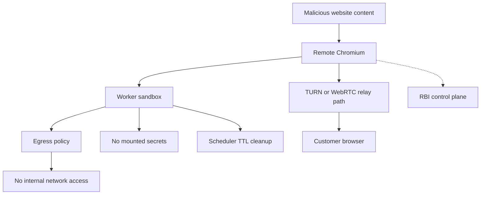

Required containment rules for production:

- Workers must run in a separate untrusted network segment.
- Workers must not reach internal service CIDRs, Kubernetes APIs, Docker sockets, Redis,
  control-plane admin ports, CI systems, customer management networks, or cloud metadata
  endpoints such as `169.254.169.254`.
- Worker egress should be forced through an allowlisted egress proxy or firewall path.
- RFC1918 and internal ranges should be denied unless a specific isolated browsing use
  case requires them and has separate controls.
- Workers must not mount host paths, long-lived secrets, service account tokens, internal
  CA bundles beyond what is required, or cloud provider credentials.
- Workers should run non-root with no privileged mode, no host networking, no Docker
  socket, dropped Linux capabilities, seccomp, no-new-privileges, memory limits, CPU
  limits, pid limits, and read-only root filesystem where practical.
- TURN should relay WebRTC media and data only. TURN must not become a path into
  internal services.
- Session logs must not store full page content, credentials, cookies, form data, or
  sensitive handoff query values.
- Downloads, uploads, clipboard, print, camera, microphone, and local file access must
  default to blocked until product policy explicitly enables and instruments them.

## Data And State Model

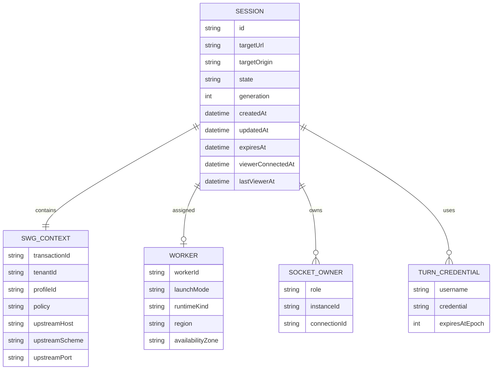

In memory mode, this state is process-local. In Redis mode, the session store and signal
bus provide cross-instance state and pending-signal delivery.

## Deployment View

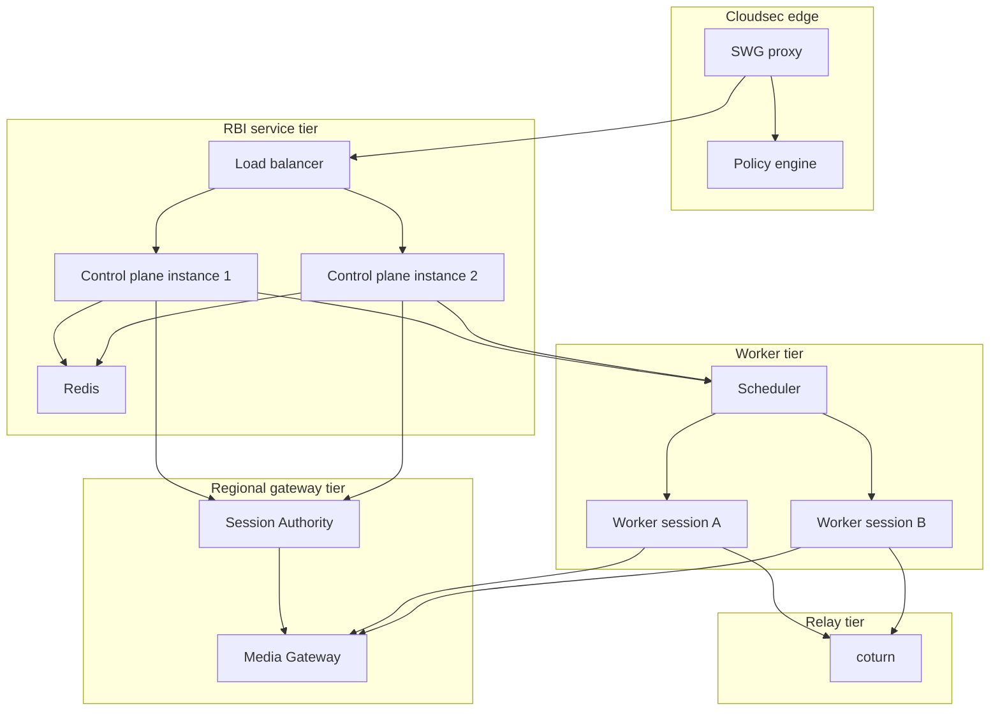

Production deployment expectations:

- Run control plane behind TLS.
- Run media gateways as the viewer-facing WebRTC/SRTP ingress for Cat-B sessions.
- Use Redis for multi-instance session, signal, and replay state.
- Run TURN with REST HMAC authentication.
- Size media gateways and TURN bandwidth for relayed video traffic.
- Place workers close to users and target websites where possible.
- Keep worker egress controlled and observable.
- Run worker containers with seccomp, sandbox strategy, and least privilege.

## Gaps, Recommendations, And Open Decisions

This section is the single register for known gaps, production recommendations, and
open architecture decisions.

| Area | Current state | Risk | Recommendation or required work |
| --- | --- | --- | --- |
| SWG adapter | Runtime contract exists but SWG-side adapter is not implemented here | Isolate decision cannot route to this provider safely | Implement SWG adapter that signs bootstrap, maps tenant/profile/policy/upstream context, redirects to `handoffUrl`, and falls back to Menlo on timeout or invalid response |
| Provider canary | Selection is documented only | Broad rollout could route unsupported traffic | Add provider canary config, per-tenant allowlist, traffic-slice gating, kill switch, and telemetry comparing Menlo versus cloudsec outcome |
| Traffic scope | Runtime supports top-level browser sessions best | File, upload, download, and non-browser flows could bypass required controls | Start only with top-level browser `GET` or `HEAD` document navigations; keep file, DLP, FTC, upload, download, local AV, and `CONNECT` flows on Menlo |
| Scheduler | Docker, ECS, and host-agent adapters are present | Multiple launch modes increase operational and security variance | Choose one cloudsec production scheduler, document its isolation boundary, and remove or disable unused adapters |
| Worker sandbox | Worker runs non-root and supports seccomp; Docker launch does not yet enforce all hardening flags | Browser compromise could escape more easily or consume host resources | Add no privileged mode, no host network, no Docker socket, `--cap-drop=ALL`, no-new-privileges, read-only root filesystem where practical, tmpfs for writable paths, memory limits, CPU limits, pid limits, and seccomp enforcement |
| Chromium sandbox | Enabled by default unless `WORKER_DISABLE_CHROMIUM_SANDBOX=1` | Disabling sandbox weakens exploit containment | Prohibit sandbox disablement in production except approved break-glass; alert if disabled |
| Worker network containment | Not enforced in this repo | Compromised browser could scan or call internal services | Put workers in untrusted network segment; block RFC1918/internal ranges, cloud metadata IPs, control-plane ports, Redis, Kubernetes APIs, Docker APIs, CI systems, and management networks |
| Worker egress | Not defined in this repo | Data exfiltration and malware callback risk | Force egress through SWG-controlled proxy or firewall; log destinations; apply domain/IP allow or policy where possible; rate-limit and anomaly-detect worker egress |
| Secrets isolation | Worker receives session token and TURN credentials by env; broader secret handling is deployment-defined | Mounted secrets or cloud credentials could leak to compromised browser | Do not mount host paths, service account tokens, cloud credentials, internal cert stores, or long-lived secrets into workers; use short-lived session-only credentials |
| Metadata service access | Not blocked in code | Cloud credentials could leak from worker host or task | Explicitly deny `169.254.169.254` and provider metadata endpoints with network policy or security group rules |
| TURN production posture | TURN credentials and ICE URLs exist | TURN can become bottleneck or abuse point | Deploy coturn HA with TLS certs, REST HMAC auth, realm isolation, bandwidth sizing, rate limits, allocation limits, logs, metrics, and abuse controls |
| Relay-only policy | Config supports relay-only but does not force it | Direct srflx path can expose network metadata and vary by NAT | Decide production posture; recommended high-security mode is `ALLOWED_ICE_CANDIDATE_TYPES=relay` and `VIEWER_ICE_TRANSPORT_POLICY=relay` |
| Redis security | Redis-backed store is supported; session tokens are stored in session records | Redis compromise exposes session metadata and active tokens | Use Redis TLS, auth, ACLs, private networking, no public exposure, short TTLs, backup policy review, and restricted operator access |
| Session cleanup after control-plane death | Normal termination stops workers; scheduler-level orphan cleanup is not defined | Orphan workers may persist after crash or network partition | Add scheduler TTL, periodic orphan reaper, max session duration enforcement in worker, and startup reconciliation for stale sessions |
| Browser profile disposal | Worker creates unique profile directory and deletes it on stop | Abrupt host failure may leave disk residue | Use ephemeral volumes or tmpfs for profile data; ensure scheduler deletes volumes with task; add host cleanup daemon for stale profile directories |
| Logs and metadata | Structured logs include session and target metadata | URLs, handoff parameters, tenant IDs, and policy names may be sensitive | Redact handoff signatures, tokens, cookies, full URLs with query strings, form data, credentials, and page content; restrict log access and retention |
| Viewer cookie and handoff | HttpOnly viewer cookie and signed handoff are implemented | Handoff URL still carries sensitive metadata | Keep handoff TTL short, use no-referrer or strict referrer policy, avoid logging raw handoff URLs, and require HTTPS |
| Auth and audit identity | SWG identity can be carried in client context but schema is not finalized | Session audit may not map to user/device/customer | Define required identity fields from SWG: user, device, tenant, policy, rule, request ID, source IP, auth method, and risk context |
| Product controls | Downloads, uploads, clipboard, print, camera, microphone, and local file access are not finalized | Data can leave isolated browser through enabled features | Default all such features to disabled; enable only through explicit SWG policy with audit and DLP integration |
| Malware transfer to customer | Viewer receives pixels and sends input; no file path is designed here | Downloads or clipboard could transfer malicious content if added later | Keep pixel-only path for initial release; if file transfer is added, route through existing Menlo/cloudsec DLP, AV, and file-type policy |
| Control-plane exposure | Viewer and worker WebSocket paths are exposed intentionally | Browser content should not directly access privileged APIs | Keep admin APIs out; enforce same-origin for viewer mutations; isolate worker network so page content cannot reach control-plane private endpoints |
| Capacity control | Worker lifecycle exists but no quota system is implemented | Worker exhaustion can cause outage or force unsafe fallback | Add tenant/user concurrency quotas, admission control, queue limits, worker pool capacity metrics, and deterministic fallback to Menlo |
| Observability | Structured logs exist | Operators cannot prove isolation health or debug failures at scale | Add metrics for bootstrap success, handoff success, worker launch latency, session duration, TURN relay ratio, ICE failures, idle cleanup, orphan cleanup, and fallback causes |
| Security monitoring | TURN diagnostics and logs exist; no detection rules are defined | Abuse or compromise may go unnoticed | Add alerts for unusual egress, high bandwidth, repeated browser crashes, sandbox disablement, internal IP attempts, worker lifetime violations, and TURN allocation spikes |
| Patch management | Worker image uses Debian Chromium package | Browser CVEs can directly affect containment | Define image rebuild cadence, emergency Chromium patch process, CVE gates, base image scanning, and signed image provenance |
| Runtime dependency risk | Node, Python, aiortc, Chromium, and system packages are used | Vulnerable dependencies can weaken service | Add SBOM, dependency scanning, image scanning, npm audit handling, pip audit handling, and release promotion gates |
| Data retention | Session state TTL exists; recording/storage policy is undefined | Customer browsing metadata may be retained longer than intended | Define retention for session records, logs, TURN logs, metrics, and any future recording; default to minimal metadata retention |
| Dormant code | Viewer and worker retain disabled legacy hybrid and launch branches | Dead code complicates review and attack-surface reasoning | Remove hybrid and launch remnants after WebRTC-only regression coverage is in place |
| Test coverage | Unit tests cover signing, tokens, TURN credentials, sessions, and viewport | No production containment proof yet | Add e2e tests for SWG bootstrap, replay rejection, worker orphan cleanup, relay-only ICE, Redis multi-instance signaling, and blocked internal egress |
| Threat model | Assumptions are documented here but not formalized | Security review may miss trust-boundary failures | Produce a formal threat model with assets, trust boundaries, abuse cases, mitigations, residual risk, and sign-off owners |

### Recommended First Traffic Slice

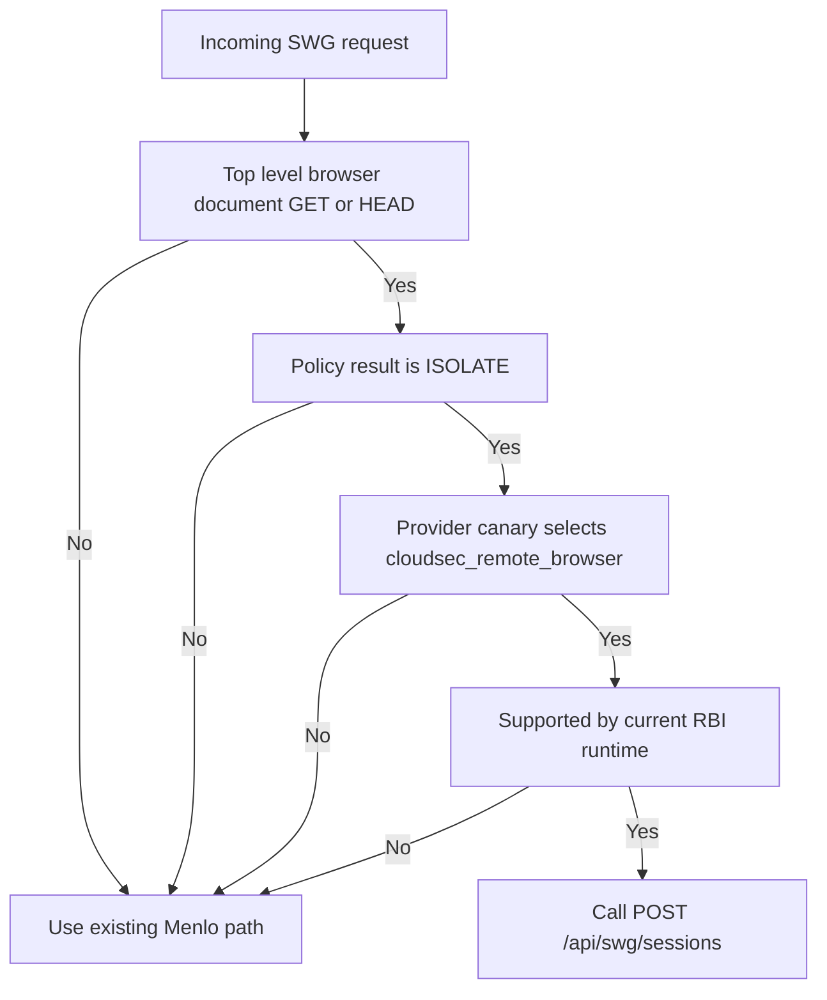

Start with top-level browser document navigations only. Continue to send file handling,
upload, download, local rendering, DLP-sensitive flows, unsupported methods, and
non-browser traffic to Menlo until parity requirements are explicit.

### Required Production Configuration

Minimum required environment:

```text
NODE_ENV=production
PORT=8080
PUBLIC_BASE_URL=https://remote-browser.example.com
PUBLIC_WS_URL=wss://remote-browser.example.com/ws
WORKER_WS_URL=wss://remote-browser.example.com/ws/worker
TOKEN_SECRET=<strong random secret>
SWG_SHARED_SECRET=<shared with SWG adapter>
TURN_SHARED_SECRET=<shared with coturn>
ENABLE_SWG_BOOTSTRAP=1
SWG_BOOTSTRAP_LOCAL_ONLY=0
SESSION_STORE_BACKEND=redis
SIGNAL_BUS_BACKEND=redis
REDIS_URL=<redis url>
VIEWER_ICE_URLS=stun:turn.example.com:3478,turn:turn.example.com:3478?transport=udp,turn:turn.example.com:3478?transport=tcp,turns:turn.example.com:443?transport=tcp
WORKER_ICE_URLS=stun:turn.example.com:3478,turn:turn.example.com:3478?transport=udp,turn:turn.example.com:3478?transport=tcp
ALLOWED_ICE_CANDIDATE_TYPES=srflx,relay
DISPLAY_WIDTH=1280
DISPLAY_HEIGHT=720
INITIAL_STREAM_SCALE=1
VIDEO_CODEC_PREFERENCES=VP8
MEDIA_GATEWAY_DEFAULT_RELAY_MODE=gateway-media-relay
SESSION_AUTHORITY_RELAY_MODE=gateway-media-relay
```

For stricter production isolation:

```text
ALLOWED_ICE_CANDIDATE_TYPES=relay
VIEWER_ICE_TRANSPORT_POLICY=relay
```

### Open Architecture Decisions

- Which production scheduler should replace the generic Docker, ECS, and host-agent choice?
- Should production force TURN relay only, or allow server-reflexive direct paths?
- What user and device identity fields should SWG pass for session audit?
- What is the required Menlo fallback behavior on bootstrap timeout or worker exhaustion?
- What browser features are allowed in the isolated worker: clipboard, uploads, downloads, print, camera, microphone, and local file access?
- What per-tenant concurrency and bandwidth quotas are required?
- Where should session recordings, audit events, and security logs land?
