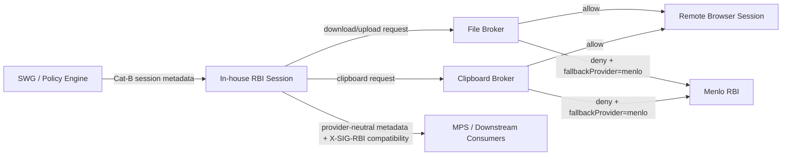

# Wave 4 Broker and Downstream Parity

## Scope
Wave 4 adds the first local Cat-B parity surface for flows that cannot be safely passed through the remote browser session as raw browser behavior. The implementation keeps the Cat-B blast radius narrow: unsupported, blocked, or high-risk file and clipboard requests return a provider-neutral deny response with `fallbackProvider: menlo` so Zeus/SWG can keep those flows on the existing Menlo RBI path.

This is not a replacement for the existing SSE policy plane. SWG and the policy engine remain the source of truth for tenant, user, risk, DLP, and feature decisions. The in-house RBI services only enforce the per-session broker contract they receive and emit auditable accept/deny outcomes.

## Implemented Components
- `services/internal/contracts/broker.go` defines the shared broker request, decision, response, and audit types used by Cat-B file and clipboard flows.
- `services/internal/filebroker` provides a Go HTTP service with `POST /v1/files`, `GET /v1/summary`, and `GET /healthz`.
- `services/internal/clipboardbroker` provides a Go HTTP service with `POST /v1/clipboard`, `GET /v1/summary`, and `GET /healthz`.
- `shared/rbi-metadata.js` emits provider-neutral RBI metadata while preserving the temporary `X-SIG-RBI-*` downstream compatibility headers.

## File Broker Contract
Supported directions are `download` and `upload`. Requests carry tenant, session, user, URL, filename, MIME type, size, policy labels, and audit metadata. The default broker accepts only explicitly supported directions, allowed MIME types, and files within the configured size limit.

Default deny reasons:
- `unsupported-direction` for unsupported directions or disabled brokers.
- `payload-too-large` for files above the configured size limit.
- `unsupported-mime-type` for MIME types outside the configured allowlist.
- `policy-blocked` for policy labels such as `block`, `dlp-block`, or `malware`.
- `scan-required` for policy labels such as `scan-required`, `requires-sandbox`, or `unknown-reputation`.

The broker response always includes a provider-neutral decision shape:
```json
{
  "id": "file-broker-opaque",
  "decision": "blocked",
  "reason": "scan-required",
  "sessionId": "sess-123",
  "tenantId": "tenant-123",
  "direction": "download",
  "action": "fallback-to-menlo",
  "fallbackProvider": "menlo",
  "auditId": "audit-opaque",
  "ttlSeconds": 300
}
```

## Clipboard Broker Contract
Supported directions are `to-remote` and `from-remote`. The default broker accepts text clipboard payloads within the configured size limit. HTML, image, binary, secret-bearing, or explicitly blocked payloads are denied and returned to the fallback provider path.

Default deny reasons:
- `unsupported-direction` for unsupported directions.
- `unsupported-mime-type` for non-text formats.
- `payload-too-large` for payloads above the configured size limit.
- `policy-blocked` for labels such as `block`, `dlp-block`, `secret`, or `credential`.

## Downstream Parity
`shared/rbi-metadata.js` keeps the temporary legacy header surface stable for MPS and related consumers:
- `X-SIG-RBI-Provider`
- `X-SIG-RBI-Provider-Category`
- `X-SIG-RBI-Tenant-Id`
- `X-SIG-RBI-Session-Id`
- `X-SIG-RBI-Profile-Id`
- `X-SIG-RBI-Policy-Id`
- `X-SIG-RBI-Origin-Type-Id`
- `X-SIG-RBI-Fallback-Provider`
- `X-SIG-RBI-Fallback-Reason`

The same helper also exposes a provider-neutral metadata envelope so new consumers can stop depending on the legacy `X-SIG-RBI-*` names once downstream parity is complete.

## Mermaid Flow


## Validation
The repo no longer keeps npm-based broker validation wrappers. Validate the
broker packages directly from `services/` with Go tooling and collect
target-runtime evidence through the deployment runbooks.

## Remaining Production Gates
- Replace the current in-memory summaries with durable telemetry export once the target observability backend is selected.
- Wire broker decisions into the gateway/runtime data paths, not only the standalone broker service endpoints.
- Add the real malware scanner, DLP verdict, and content-disarm integrations when those service contracts are available.
- Capture tenant kill-switch, Menlo fallback, and per-region rollout drill evidence.
- Certify app profiles and downstream consumers before widening Cat-B beyond the constrained top-level `GET`/`HEAD` canary.
